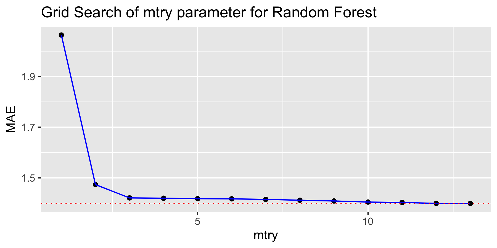
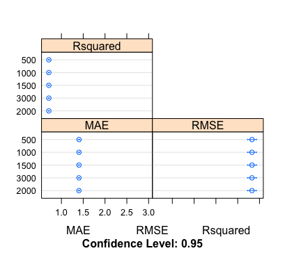
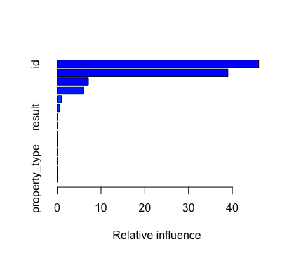
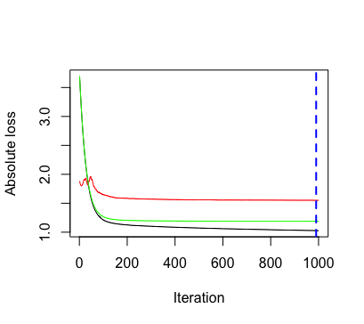
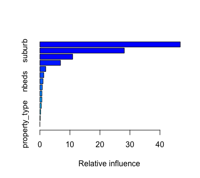

Melbourne House Price Prediction - Data Modeling
================================================

### Data Files

-   [`model_decision_tree.R`](https://github.com/Jiaying-Wu/Melbourne-House-Price-Prediction/blob/master/model/model_decision_tree.R): R Script of Decision Tree Model.

-   [`model_random_forest.R`](https://github.com/Jiaying-Wu/Melbourne-House-Price-Prediction/blob/master/model/model_random_forest.R): R Script of Random Forest Model.

-   [`model_gbm.R`](https://github.com/Jiaying-Wu/Melbourne-House-Price-Prediction/blob/master/model/model_gbm.R): R Script of Gradient Boosting Model.

Data Modeling
-------------

In this competition, we focus on these 3 tree-base models:

-   Decision Tree

-   Random Forest

-   Gradient Boosting

#### Decision Tree

The first type of model we build is Decision Tree, using the package `rpart`.

Source code `model_decision_tree.R` under `model` folder.

This model has a small cp allowed to grown a deep tree, then setting minspilt as 70. The node at least to have 70 samples to continue splitting, in order to reduce overfitting.

That is 751 end leaves, that is 751 prediction value for 32202 training samples.

    ## [1] 32202
    ## [1] 751

The size of samples in the end leaves between 23 to 69.

Variable importance:

    ##    house_size            id        suburb     land_size         nbeds 
    ##   405059.0687   285480.0293   208685.2246   175031.9353    93926.5387 
    ## property_type         ncars        nbaths          year         month 
    ##    85522.2780    55877.2581    19646.9324     7026.7036     6883.5659 
    ##        result       nvisits           day        rating 
    ##     3412.9184     1585.6482     1417.2189      996.5251

The result of this decision tree model suggested variables `house_size`, `id` and `suburb` are the top 3 affecting factors of the Melbourne house price.

    ## [1] 1.216002

The Mean Absolute Error (MAE) of the local test set is `1.216002`, it estimated the average error in out of sample prediction for Melbourne house price is `AUD121,600.2`

#### Random Forest

The second type of model we build is Random Forest, using the package `randomForest` and parameters tunning using package `caret`.

Source code `model_random_forest.R` under `model` folder.

##### Parameters tunning

First we tuned the `mtry` between 1 to 13 base on 500 trees, with 5-fold cross validation and repeat 2 times. `mtry` is the number of variables to consider in each split.

The MAE of each parameter is:

It suggested the optimize `mtry` base on 500 tree is 13

Then we tuned the parameter `ntree` base on `mtry = 13` on this sequence of tree: `500, 1000, 1500, 2000, 3000`, with 5-fold cross validation and repeat 2 times.. `ntree` is the number of trees to grow.

The plot of tunning result is:

The summary of the tunning result is:

    ##     500~MAE         1000~MAE        1500~MAE        2000~MAE    
    ##  Min.   :1.359   Min.   :1.359   Min.   :1.360   Min.   :1.361  
    ##  1st Qu.:1.389   1st Qu.:1.389   1st Qu.:1.388   1st Qu.:1.388  
    ##  Median :1.402   Median :1.401   Median :1.401   Median :1.400  
    ##  Mean   :1.403   Mean   :1.403   Mean   :1.403   Mean   :1.402  
    ##  3rd Qu.:1.416   3rd Qu.:1.417   3rd Qu.:1.417   3rd Qu.:1.417  
    ##  Max.   :1.441   Max.   :1.438   Max.   :1.436   Max.   :1.435  
    ##     3000~MAE    
    ##  Min.   :1.361  
    ##  1st Qu.:1.388  
    ##  Median :1.401  
    ##  Mean   :1.402  
    ##  3rd Qu.:1.417  
    ##  Max.   :1.436

Base on the median MAE and mean MAE, it suggested `ntree = 2000`

Base on grid search, the optimized parameters for fitting random forest model in this dataset is `mtry = 13, ntree = 2000`.

The variable importance plot base on the optimize Random Forest model is:

It suggested the top affecting 3 factors for Melbourne house price in this model is `house_size`, `id`, `ncars`.

The Mean Absolute Error (MAE) of the local test set is `1.334874`, it estimated the average error in out of sample prediction for Melbourne house price is `AUD133,487.4`.

#### Gradient Boosting

The third type of model we build is Gradient Boosting, using the package `gbm`. We build two model with two different distribution `gaussian` and `laplace`.

Source code `model_gbm.R` under `model` folder.

The reason we choose this two distribution was the distribution of Melbourne house price has a first increasing exponential then decreasing exponential, share the same property of laplace distribution. The house price after taking the log follow the gaussian distribution.

##### Gradient Boosting with gaussian distribution

We train this Gradient Boosting model with the following parameters:

    gbm_gaussian <- gbm(log_price~.-price, 
                     data = train_85,
                     distribution = "gaussian",
                     n.trees = 1000,
                     shrinkage=0.01,
                     interaction.depth = 20,
                     n.minobsinnode = 30,
                     bag.fraction = 0.8,
                     train.fraction = 0.8,
                     cv.folds = 4,
                     n.cores = 4)

Choosing the number of trees base on cross validation, it was 752.

The feature important plot suggested `id` is the most important variable.

The Mean Absolute Error (MAE) of the local test set is `1.413301`, it estimated the average error in out of sample prediction for Melbourne house price is `AUD141,330.1`.

##### Gradient Boosting with laplace distribution

We train this Gradient Boosting model with the following parameters:

    gbm_laplace <- gbm(price~.-log_price, 
                        data = train_85,
                        distribution = "laplace",
                        n.trees = 1000,
                        shrinkage = 0.028,
                        interaction.depth = 21,
                        n.minobsinnode = 30,
                        bag.fraction = 0.8,
                        train.fraction = 0.8,
                        cv.folds = 4,
                        n.cores = 4)

Choosing the number of trees base on cross validation, it was 990.

The feature important plot suggested `suburb` is the most important variable.

The Mean Absolute Error (MAE) of the local test set is `1.22285`, it estimated the average error in out of sample prediction for Melbourne house price is `AUD122,285`.
